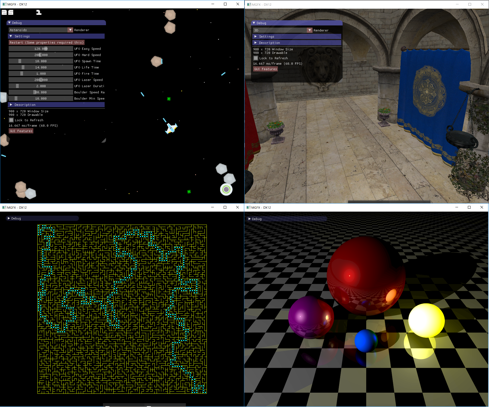
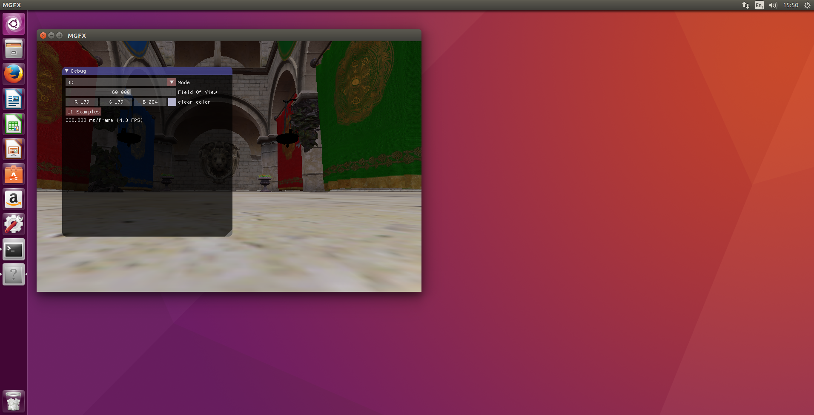

[MGFX](https://github.com/cmaughan/mgfx) - Cross-platform 2D (CPU & GPU) and 3D (GPU) rendering starter kit
============================================================================

[](https://travis-ci.org/cmaughan/mgfx)
[](https://ci.appveyor.com/project/cmaughan/mgfx)
[](https://coveralls.io/github/cmaughan/mgfx?branch=master)
[](https://scan.coverity.com/projects/cmaughan-mgfx)
[](https://gitter.im/cmaughan/mgfx)
[](https://github.com/cmaughan/mgfx/blob/master/LICENSE)

An example of how to do cross-platform 2D (CPU & GPU) and 3D (GPU) rendering.  A quick, simple starter kit for getting something on the screen.
Written using Modern C++ 11, using simple cross-platform libraries.  This isn't a game engine of any kind - but it can be used as a starter sample
to show how to get the basics up and running.
I created this sample to help with our teaching efforts at [YorkDevelopers](https://yorkdevelopers.org), since it can be used to help C++ programmers
draw on the screen without all the boilerplate code.  

The project is also a useful guide for how to build an open source project with continuous integration, cmake, documentation and unit tests.
There is a sample here of drawing a 3D Scene, or you can use it to draw to an RGBA memory buffer using the CPU, and transfer
it to the screen.
Currently the the starter kit can use OpenGL & Direct3D 12 to do the drawing.  Also included is ImGui - a very powerful, easy to use UI framework,
makes it easy to draw a user interface on your application, using very little code.

In 3D Mode, a simple mesh loader is provided, which loads a custom mesh format.  A tool - MGeo is also supplied to load many mesh formats and convert
them to the binary format used - based on Google Flatbuffers.  Full source and schema is in the repository.

Screenshots
-----------


Samples within the framework


The 3D scene in Ubuntu (runs on OSX too)

MGFX
-----
The main part of this project is called MGFX.  Running it will let you play with the demos using the drop-down menu.
It has been tested on Ubuntu 16, Windows 10 & macOS Sierra. See the Render() function in the various demos to see them in action.
The mgfx_core library has the common code for setting up a device and managing 2D & 3D setup, such as adding cameras and windows.
The m3rdparty directory contains useful 3rd party libraries.  The mcommon folder contains useful C++ code for things like manipulating files.
The samples are mostly from various teaching sessions with York Developers.  Each demo has a description section in the GUI.

- Ray Tracer
- Asteroids Game
- Maze Generator
- Sponza 3D
- Game Of Life

```
mgfx --gl  // Open GL Render
mgfx --d3d // DX12 Render
```

MGeo
-----
This simple convertor uses Assimp to load a 3D Mesh, then outputs an optimized 3D mesh for rendering.
The mesh is triangulated, split into material groups and optimized.  Normals are added, the mesh is cleaned, 
and tangents are optionally added.

Once the mesh is processed, it is output using a flatbuffer file format schema.  The generated flatbuffer header is used in the Mesh code to read the flat buffer.

A typical commandline:
```
mgeo --input input_mesh.obj --tangents 0
```

This will convert the input_mesh.obj to input_mesh.mmesh - the binary format.  The output will not include generated tangents.
You can expect the output to contain:

- Materials (various color and texture fields).
- Meshes (a list of mesh parts, each mapped to a single material, with seperate attribute list).
- Bounding boxes for each mesh and the whole file.

More details in the [schema](https://github.com/cmaughan/mgfx/tree/master/mcommon/schema/model.fbs)
It is quite straightforward to read the material.fbs and model.fbs files.

This tool does not currently convert textures in any way.  It simply strips the file extension off the texture name before preserving it in the material.
In this way, you can write a loader that finds multiple possible texture formats.  
A future work item might be to process the textures too and convert them to compressed formats, etc.

CI, Coverage & Coverity
-----------------------
I used this project as a learning experience for setting up Open Source continuous integration builds.  The project is built by Travis-CI on linux at every checkin,
with both the Clang & GCC compilers, in Debug & Release.  Coverage is generated for the unit tests, and an optional Coverity source scan is also performed.
The output of the various build processes can be followed from the build buttons:
[](https://travis-ci.org/cmaughan/mgfx)
[](https://ci.appveyor.com/project/cmaughan/mgfx)
[](https://coveralls.io/github/cmaughan/mgfx?branch=master)
[](https://scan.coverity.com/projects/cmaughan-mgfx)

Building
---------
You can follow the build buttons above to see build scripts, but the process is fairly simple:


##### Install Packages  
If you don't have them already, the following packages are required, depending on your system.  Note, that SDL and Assimp are now part of the build,
and not installed seperately.  If you have compilation problems, you might need to investigate the compiler you are using.
Ubuntu 16 & 17 both have a recent enough version for it to work.

###### Linux
```
sudo apt install freeglut3-dev  
sudo apt install cmake  
sudo apt install git  
```

###### Mac
```
brew install cmake
brew install git
```
(If in doubt, see the .travis.yml build file for how the remote build machines are setup)

##### Get the Source
git clone https://github.com/cmaughan/mgfx mgfx  
cd mgfx  

##### Make
There are some sample scripts which call CMake, but you can generate makefiles for your favourite compiler by passing a different generator to it.
The `config_lean.bat` file make a more minimal configuration that doesn't build MGeo or the associated libraries (not required for the demo).

###### Linux 
```
./config.sh
make
```  

###### Mac (XCode)
```
./config_mac.sh
cd build
cmake --build .
```
###### PC
```
config.bat
cd build
cmake --build .
(Or load solution in VC 2017)
```

##### Tests

Type `CTest --verbose` in the build folder to run unit tests.

Credits
----------
[OpenGL Tutorials](http://www.opengl-tutorial.org)  
Some great tutorials here, and a great reference for when you can't remember how to do something in OpenGL.  

[MiniEngine](https://github.com/Microsoft/DirectX-Graphics-Samples/tree/master/MiniEngine/ModelConverter)  
Microsoft's mini engine has lots of useful sample code in it.  The Model convertor section has a useful section on how to call the Assimp library.
Microsoft's solution uses a custom binary file format, but my approach uses a more flexible flatbuffer approach.
The MiniEngine forms the basis of the DX12 renderer.

[SAL](https://github.com/svens/sal)  
A shout-out to this 'Server Application Library' on github.  An excellent example of how to setup clean CI build scripts.
I learned a few CMake tricks along the way too.  

[Shooter Assets](http://kenney.nl/assets/space-shooter-redux)
This sprite map has been used in the asteroids demo.

Libraries
-----------
These libraries are in a folder called 'm3rdparty'.  They are useful for various projects.

[SDL2: Media/Window Layer](https://www.libsdl.org/download-2.0.php)  
SDL2 is used to get a window on the screen in a cross platform way, and for OpenGL to generate a Context.

[ImGui: 2D GUI](https://github.com/ocornut/imgui)  
ImGui is a great 2D User interface for 3D applications

[GLM: Maths](http://glm.g-truc.net/0.9.7/index.html)  
This is the only math library you need for 3D Graphics...

[EasyLogging: Debug Logs](https://github.com/muflihun/easyloggingpp)  
A great logging tool, making it easy to write information to the debugger or command line

[STB: Texture Loading](https://github.com/nothings/stb)  
There are many useful things in the STB library; I am using it here to load PNG texture files

[Assimp](http://www.assimp.org)  
Assimp can load most model formats.  It should work with most file types, but has been tested on .obj files.  The MGeo project builds it on demand, since it is a big library
